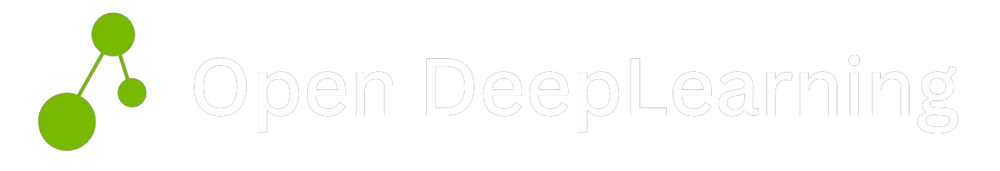

<div align="center">
  <a href="https://www.openmlguide.org/" target="_blank" >
    
  </a>
</div>

<br/>
<div align="center">

[](https://discord.gg/kYYatgzV4p)
[](https://twitter.com/Open_DL_AI)
[](http://openmlguide.org/)
[](https://opensource.org/licenses/MIT)

</div>
<br/>

Open DeepLearning is your go-to for enhancing AI expertise, offering a clear progression from basics to advanced concepts. Stay current with the latest AI innovations that reshape the field, accessing free, high-quality resources such as courses, books, tutorials, and research papers. Whether you're starting out or an expert, our open-source initiative is dedicated to streamlining your learning path and aiding mastery in the field.

Our goal is to simplify your learning journey with a clear roadmap to mastery.

## Feedback

Your feedback is the cornerstone of this guide! Whether you have queries, thoughts, or creative suggestions, we welcome them all. Let's make this learning experience even more awesome together; connect with us through:

- Make an issue on [GitHub](https://github.com/severus27/OpenML-Guide)
- Email us at [openmlguide@gmail.com](mailto:openmlguide@gmail.com)
- Join our [Discord community](https://discord.gg/sPEeV3E7tS)
- Follow us on [Twitter](https://twitter.com/AIPortalGun)

Consider your feedback as the algorithmic tweak that fine-tunes our ML guide for maximum awesomeness. Your thoughts are the code to an upgraded learning experience.

## Contributing

Contributions to the guide are welcome! Here are some ways you can help:

- **Suggest new topics:** Open an issue to propose a new machine learning concept or technique to cover.

- **Write new content:** Submit a pull request with draft content for a new or existing guide topic.

- **Review content:** Read through existing guide topics and open issues to suggest improvements.

- **Fix bugs:** If you find a mistake, bug or formatting issue, please open a pull request to fix it.

- **Translate the website into another language:** We need assistance translating the site into various languages. If interested, join our [Discord community](https://discord.gg/sPEeV3E7tS) and indicate your interest in the corresponding language, or simply push the repository. For additional information, refer to the [Next.js i18 docs](https://nextra.site/docs/guide/i18n).

For more information, kindly refer to the instructions provided on the [contribution page](https://www.openmlguide.org/contribute/).

## Running the guide locally

Ensure that you have Node version >= 18.X.X . Subsequently, execute the following commands in a terminal:

Install [pnpm](https://pnpm.io/installation) if not present in your system.

```
# download the website code with git
git clone https://github.com/severus27/OpenML-Guide.git

# install the dependencies.
pnpm install

# start the development server
pnpm dev
```
