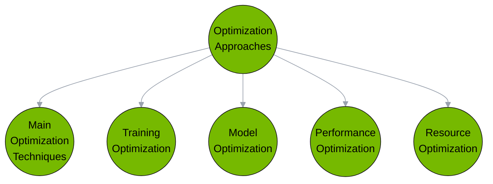

# Optimization in LLMs

Optimization in Language Models (LLM) plays a crucial role in enhancing performance, efficiency, and overall effectiveness. At its core, optimization involves refining the model's parameters to achieve the best possible outcomes in terms of accuracy and speed. 

## Why Advanced LLM Optimization is Crucial?

As LLMs grow to unprecedented sizes, their training and operational costs scale exponentially. Without optimization, advanced LLMs with hundreds of billions of parameters would be prohibitively expensive and time-consuming to develop. Optimization makes scaled-up LLMs feasible and broadly deployable.

Optimization also counteracts accuracy and quality issues stemming from overparameterization. Unoptimized huge models repeat prompts, hallucinate content, and require more fine-tuning. Optimization targets the most critical parameters for efficiency and performance gains.

Finally, optimized LLMs better address customer needs. Compressing models for mobile apps, tailoring them to specific tasks, and rate-limiting inference latency allows LLMs to integrate into real products and services.

## Approaches to Optimizing LLM Performance

### Main Optimization Techniques

The key to unlocking the full potential of large language models is dedicated optimization leveraging these core techniques:

- **Prompt Engineering** involves carefully crafting the text prompts fed into the LLM to provide helpful context guiding its responses for the desired use case. Well-designed prompts can steer model performance without additional training. However, the model's inherent capabilities set bounds on how much prompts alone can achieve.

- **Retrieval-Augmented Generation (RAG)** supplements the prompt by retrieving and appending relevant external information to fill gaps in the model's knowledge. This additional context aids the LLM in answering obscure questions or discussing niche topics by providing supporting evidence. But the augmentation is only as useful as the quality and coverage of the retrieval source database.

- **Fine-Tuning** directly evolves the parameters of a pretrained LLM by continuing training on datasets related to the target task. This specialized training shifts the model's capacities to excel at standing out in an intended application area. However, excessive fine-tuning risks degrading capabilities on unrelated skills the model previously excelled at.

In practice, combining these complementary techniques compounds optimization effects:

- Prompt engineering translates model skills into target task performance
- Retrieval fills individual knowledge gaps identified by the prompt scenario
- Fine-tuning molds model parameters to star in associated applications

The process is iterative - many prompt and tuning attempts will fail before discovering what clicks. But incremental refinements compound, with each successful optimization approach stacking to further boost performance. A finely-crafted prompt, retrieved evidence, and targeted fine-tuning together enable state-of-the-art results.

### Training Techniques

LLM training is very computationally expensive, so optimized training approaches maximize utilization of available compute. Methods include efficient batching strategies, gradient accumulation, precision reduction, mix-precision training, gradient checkpointing, and optimized data pipelines.

### Improved Accuracy

A fine-tuned LLM can provide more accurate and relevant responses, reducing the likelihood of errors or irrelevant outputs.

### Task-specific Refinement

Businesses often have unique needs. By optimizing LLMs for specific tasks, they can become more effective tools tailored to precise industry requirements.

### Mitigating Biases

All models might have biases based on their training data. Optimization can help reduce these biases, leading to more neutral and fair responses.

### Efficient Inference

Optimized inference enables models to provide useful output with minimal latency. This includes techniques like knowledge distillation to compress models, model quantization, efficient caching and indexing strategies, and optimized compilers and hardware.

### Pruning and Compression

Pruning removes redundant or non-critical parameters in a model to create smaller, specialized versions with fewer computations. Related compression techniques like quantization and encoding also optimize model size.

### Scaling Laws

Scaling laws analyze how different model resources impact metrics like performance vs. computational cost. These laws guide what resources to allocate when designing LLMs to meet optimization goals.

### Future Directions

Ongoing research is expanding optimization of LLM training objectives, multi-task model efficiency, low-power model deployment, and automated optimization approaches. Codesign of algorithms with specialized hardware also provides further gains.
